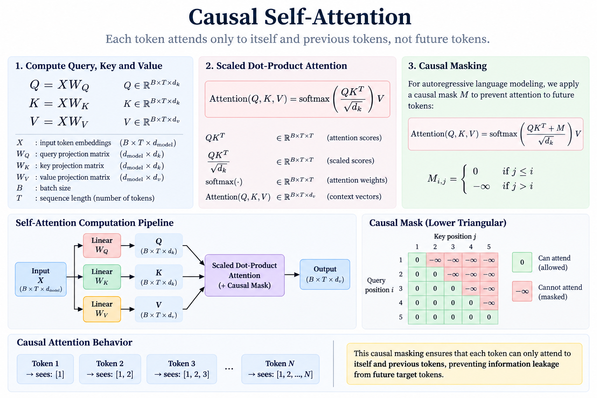
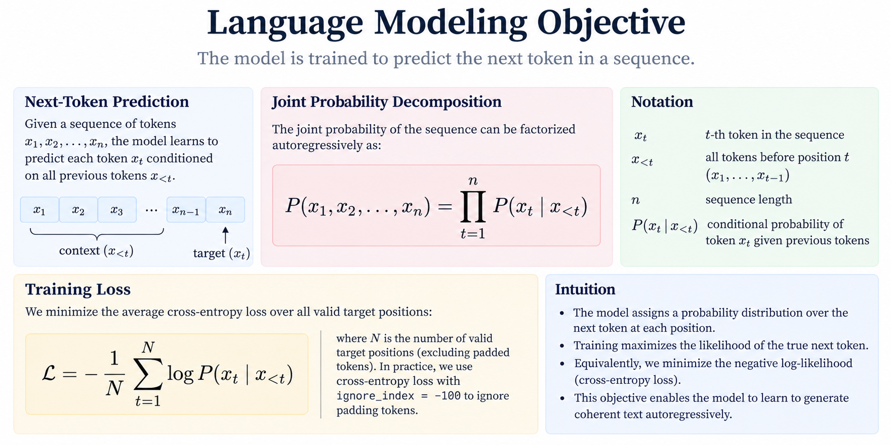
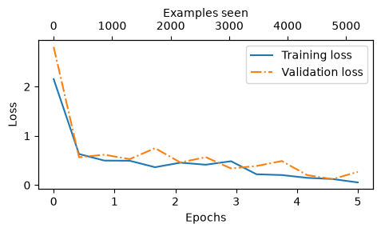
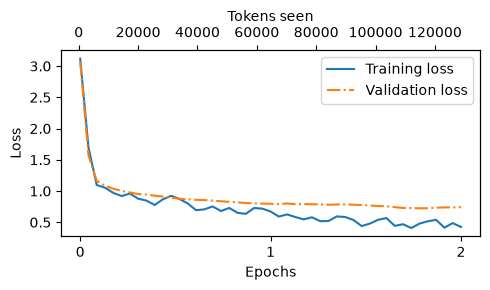
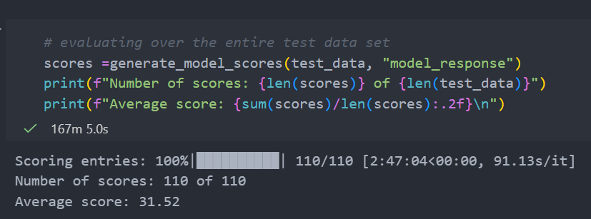
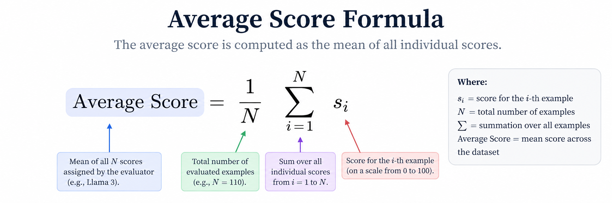

# BareGPT: Technical Implementation

A from-scratch implementation and experimentation repository for understanding the internals of a decoder-only Large Language Model (LLM), following the architecture, training methodology, and instruction fine-tuning workflow.

The project focuses on implementing the core Transformer/GPT pipeline rather than treating the model as a black-box API:

```text
Raw Text
   │
   ▼
Tokenization
   │
   ▼
Token IDs
   │
   ▼
Token + Positional Embeddings
   │
   ▼
Transformer Blocks
   │
   ├── Multi-Head Self-Attention
   ├── Layer Normalization
   ├── Feed-Forward Network / GELU
   └── Residual Connections
   │
   ▼
GPT Language Model
   │
   ├── Pretraining / pretrained-weight loading
   │
   ▼
Instruction Fine-Tuning
   │
   ▼
Instruction-Following GPT
   │
   ▼
Test-Set Response Generation
   │
   ▼
LLM-as-a-Judge Evaluation
   │
   ▼
Llama 3 via Ollama
   │
   ▼
0–100 Evaluation Scores
```

---

## Table of Contents

- [Project Overview](#project-overview)
- [Objectives](#objectives)
- [Repository Structure](#repository-structure)
- [Model Architecture](#model-architecture)
  - [GPT Configuration](#gpt-configuration)
  - [Tokenization](#tokenization)
  - [Embeddings](#embeddings)
  - [Causal Self-Attention](#causal-self-attention)
  - [Multi-Head Attention](#multi-head-attention)
  - [Transformer Block](#transformer-block)
  - [GPT Model](#gpt-model)
- [Data Pipeline](#data-pipeline)
- [Language Modeling Objective](#language-modeling-objective)
- [Pretrained GPT-2 Weights](#pretrained-gpt-2-weights)
- [Instruction Fine-Tuning](#instruction-fine-tuning)
  - [Instruction Formatting](#instruction-formatting)
  - [Batch Construction](#batch-construction)
  - [Padding and Ignore Index](#padding-and-ignore-index)
- [Inference](#inference)
- [Evaluation Methodology](#evaluation-methodology)
  - [Qualitative Evaluation](#qualitative-evaluation)
  - [LLM-as-a-Judge](#llm-as-a-judge)
  - [Ollama + Llama 3](#ollama--llama-3)
- [Results](#results)
- [Training Curves](#training-curves)
- [Technical Notes](#technical-notes)
- [Limitations](#limitations)
- [Key Learnings](#key-learnings)
- [References](#references)

---

# Project Overview

This repository implements the major components required to construct and adapt a GPT-style decoder-only Transformer.

The implementation covers the transition from:

```text
Transformer fundamentals
        ↓
GPT architecture
        ↓
Pretrained GPT-2 model
        ↓
Supervised instruction fine-tuning
        ↓
Instruction-following inference
        ↓
Automated LLM evaluation
```

The objective is not simply to obtain a working text-generation model, but to understand the computational path from token IDs to next-token logits, the optimization process used during training, and the changes introduced by supervised instruction fine-tuning.

---

# Objectives

The project has the following technical objectives:

1. Implement the GPT/Transformer architecture at the component level.
2. Understand autoregressive next-token prediction.
3. Implement causal self-attention and multi-head attention.
4. Implement Transformer blocks using residual connections, LayerNorm, and feed-forward sublayers.
5. Load and execute pretrained GPT-2 weights.
6. Construct an autoregressive text-generation pipeline.
7. Build an instruction dataset and batching pipeline.
8. Fine-tune GPT-2 on supervised instruction-response pairs.
9. Generate responses from the fine-tuned model on a held-out test set.
10. Evaluate generated responses using a separate instruction-tuned LLM.
11. Use Ollama to run Llama 3 locally as an LLM-as-a-judge evaluator.

---

# Repository Structure

A representative project structure is:

```text
gpt_scratch/
│
├── components/
│   ├── model.py
│   └── pretrain.py
│
├── pretraining/
│   ├── gpt_download.py
│   ├── main.ipynb
│   └── ...
│
├── utils/
│   └── load_weight_gpt.py
│
├── instruction_finetuning/
│   ├── instruction-finetuning.ipynb
│   ├── instruction-data.json
│   ├── instruction-data-with-response.json
│   └── ...
│
├── gpt2/
│   └── ...
│
├── *.pth
├── requirements.txt
└── README.md
```

---

# Model Architecture

## GPT Configuration

The instruction fine-tuning experiment uses the GPT-2 Small configuration:

| Parameter | Value |
|---|---:|
| Model | GPT-2 Small |
| Parameters | ~124M |
| Vocabulary size | 50,257 |
| Context length | 1,024 tokens |
| Embedding dimension | 768 |
| Transformer layers | 12 |
| Attention heads | 12 |
| Dropout | 0.0 |
| QKV bias | Enabled |

The configuration used for the instruction fine-tuning experiment is:

```python
BASE_CONFIG = {
    "vocab_size": 50257,
    "context_length": 1024,
    "drop_rate": 0.0,
    "qkv_bias": True
}

model_configs = {
    "gpt2-small (124M)": {
        "emb_dim": 768,
        "n_layers": 12,
        "n_heads": 12
    }
}
```

---

## Tokenization

The instruction fine-tuning pipeline uses the GPT-2 tokenizer through `tiktoken`.

```python
tokenizer = tiktoken.get_encoding("gpt2")
```

The GPT-2 vocabulary contains 50,257 token IDs, with the padding/end-of-text token represented by ID `50256` in this implementation.

Tokenization converts natural-language sequences into integer token IDs:

```text
Text
 ↓
Tokenizer
 ↓
[Token ID 1, Token ID 2, ..., Token ID N]
```

These IDs are then converted into dense vector representations through the token embedding matrix.

---

## Embeddings

Each token ID is mapped to a learned embedding vector.

For GPT-2 Small:

```text
Vocabulary = 50,257
Embedding dimension = 768
```

The resulting tensor has the conceptual shape:

```text
(batch_size, sequence_length, embedding_dimension)
```

Positional information is incorporated so that the Transformer can distinguish token ordering.

---

# Causal Self-Attention



---

# Multi-Head Attention

Instead of computing one attention operation, GPT uses multiple attention heads.

Each head learns a separate representation of token-to-token relationships.

For GPT-2 Small:

```text
Embedding dimension = 768
Attention heads = 12
Head dimension = 768 / 12 = 64
```

Conceptually:

```text
768-dimensional representation
          │
          ├── Head 1  → 64 dimensions
          ├── Head 2  → 64 dimensions
          ├── ...
          └── Head 12 → 64 dimensions
```

The head outputs are concatenated and projected back into the model embedding dimension.

---

# Transformer Block

Each Transformer block contains the standard GPT-style components:

```text
Input
  │
  ▼
Layer Normalization
  │
  ▼
Multi-Head Self-Attention
  │
  ▼
Residual Connection
  │
  ▼
Layer Normalization
  │
  ▼
Feed-Forward Network
  │
  ▼
Residual Connection
  │
  ▼
Output
```

The feed-forward subnetwork uses a GELU activation.

The implementation includes:

- `GELU`
- `LayerNorm`
- `FeedForward`
- `TransformerBlock`
- `GPTModel`

---

# GPT Model

The GPT model is a stack of Transformer blocks followed by a final normalization/output projection.

Conceptually:

```text
Token IDs
    ↓
Token Embeddings
    +
Positional Embeddings
    ↓
Transformer Block × 12
    ↓
Final LayerNorm
    ↓
Linear Output Projection
    ↓
Vocabulary Logits
    ↓
Next-token probabilities
```

For GPT-2 Small, the output dimensionality at each position is:

```text
50,257 vocabulary logits
```

---

# Data Pipeline

## Instruction Dataset

The instruction fine-tuning dataset consists of examples containing:

```text
instruction
input
output
```

The dataset is partitioned into:

```text
Training   → 85%
Test       → 10%
Validation → 5%
```

The resulting test set contains 110 examples in the current experiment.

---

## Instruction Formatting

Each example is converted into a structured prompt:

```text
Below is an instruction that describes a task.
Write a response that appropriately completes the request.

### Instruction:
<instruction>

### Input:
<input>
```

The target response is represented as:

```text
### Response:
<expected output>
```

The model therefore learns the mapping:

```text
Instruction + Input
        ↓
Response
```

---

# Batch Construction

Instruction examples have variable sequence lengths.

The custom collate function:

1. Determines the longest sequence in a batch.
2. Appends the padding token.
3. Pads shorter examples.
4. Splits each sequence into input and target tensors.
5. Applies truncation when necessary.
6. Replaces irrelevant padding targets with the ignore index.

The resulting tensors follow the autoregressive language-modeling convention:

```text
inputs  = tokens[0 : N-1]
targets = tokens[1 : N]
```

Therefore:

```text
Input:   A B C D
Target:  B C D E
```

---

# Padding and Ignore Index

Padding tokens should not contribute to the optimization objective.

The implementation therefore replaces padding positions in the target tensor with:

```python
ignore_index = -100
```

PyTorch's cross-entropy loss ignores these positions.

This prevents the model from being rewarded or penalized for predicting artificial padding tokens.

---

# Language Modeling Objective




Conceptually:

```text
Input:
"The capital of France is"

Target:
"Paris"
```

The model learns to assign high probability to the correct next token.

---

# Pretrained GPT-2 Weights

Instead of training a 124M-parameter language model entirely from random initialization, the implementation loads pretrained GPT-2 weights.

The model configuration is instantiated first:

```python
model = GPTModel(BASE_CONFIG)
```

Then the pretrained parameters are loaded:

```python
load_weights_ingpt(model, params)
```

This produces a pretrained autoregressive language model that can subsequently be adapted through supervised fine-tuning.

---

# Instruction Fine-Tuning

Instruction fine-tuning adapts the pretrained language model from generic next-token prediction toward following explicit natural-language instructions.

The model starts from pretrained GPT-2 parameters:

```text
Pretrained GPT-2
      ↓
Instruction-response dataset
      ↓
Supervised fine-tuning
      ↓
Instruction-following GPT-2
```

The fine-tuning experiment uses:

| Hyperparameter | Value |
|---|---:|
| Model | GPT-2 Small |
| Epochs | 2 |
| Batch size | 8 |
| Learning rate | 5 × 10⁻⁵ |
| Weight decay | 0.1 |
| Optimizer | AdamW |
| Context length | 1024 |
| Evaluation frequency | Every 5 iterations |
| Evaluation iterations | 5 |
| Random seed | 123 |

The optimizer is initialized as:

```python
optimizer = torch.optim.AdamW(
    model.parameters(),
    lr=0.00005,
    weight_decay=0.1
)
```

Training is performed through the custom training loop:

```python
train_model_simple(
    model,
    train_loader,
    val_loader,
    optimizer,
    device=device,
    num_epochs=2,
    eval_freq=5,
    eval_iter=5,
    start_context=format_input(val_data[0]),
    tokenizer=tokenizer
)
```

---

# Training Curves

The training procedure records:

- Training loss
- Validation loss
- Tokens seen

These are visualized using the loss-plotting utility.

## Training / Validation Loss




---

## Tokens Seen vs Loss



---

# Inference

After fine-tuning, the model generates responses autoregressively.

The generation pipeline is:

```text
Instruction
    ↓
GPT-2 tokenizer
    ↓
Token IDs
    ↓
Fine-tuned GPT
    ↓
Logits
    ↓
Next-token selection
    ↓
Append generated token
    ↓
Repeat
    ↓
Generated response
```

The experiment uses:

```python
max_new_tokens = 256
```

for test-set response generation.

Generated responses are stored in:

```text
instruction-data-with-response.json
```

Each test example therefore contains both the reference response and the fine-tuned model's generated response.

---

# Evaluation Methodology

The evaluation is divided into two stages.

## Stage 1 — Qualitative Evaluation

The generated response is inspected alongside the expected response:

```text
Instruction
    ↓
Reference Response
    ↓
Fine-Tuned GPT Response
```

Example :

```text
Below is an instruction that describes a task. Write a response that appropriately completes the request.

### Instruction:
Rewrite the sentence using a simile.

### Input:
The car is very fast.

Correct response:
>> The car is as fast as lightning.

Model response:
>> The car is as fast as a horse.
-------------------------------------
Below is an instruction that describes a task. Write a response that appropriately completes the request.

### Instruction:
What type of cloud is typically associated with thunderstorms?

Correct response:
>> The type of cloud typically associated with thunderstorms is cumulonimbus.

Model response:
>> The type of cloud typically associated with thunderstorms is a tropical rainforest.
-------------------------------------
...

Model response:
>> 50 miles per hour is approximately 5.5 kilometers per hour.
-------------------------------------
Output is truncated. View as a scrollable element or open in a text editor. Adjust cell output settings...
```

This provides qualitative insight into whether the fine-tuned model is following the instruction.

---

# Stage 2 — LLM-as-a-Judge

Manual inspection does not scale well across the entire test set.

The project therefore uses another LLM as an evaluator.

```text
                 ┌───────────────────────┐
                 │ Fine-tuned GPT-2      │
                 └───────────┬───────────┘
                             │
                             │ generated response
                             ▼
                 ┌───────────────────────┐
                 │ Test-set record       │
                 │                       │
                 │ instruction           │
                 │ reference response    │
                 │ model response        │
                 └───────────┬───────────┘
                             │
                             ▼
                 ┌───────────────────────┐
                 │ Llama 3 8B            │
                 │ via Ollama             │
                 └───────────┬───────────┘
                             │
                             ▼
                       Score: 0–100
```

The evaluator receives:

1. The original instruction.
2. The expected/reference output.
3. The response generated by the fine-tuned GPT.
4. A scoring instruction requiring an integer from 0 to 100.

---

# Ollama + Llama 3

Ollama is used as the local inference runtime for the evaluator model.

The evaluator model is:

```text
Llama 3
```

and is accessed through the local Ollama HTTP API:

```text
http://localhost:11434/api/chat
```

The Python implementation sends requests to Ollama using `urllib.request`.

The evaluator is configured with:

```python
{
    "seed": 123,
    "temperature": 0,
    "num_ctx": 2048
}
```

The temperature is set to zero to reduce sampling variability.

The evaluator prompt has the following logical structure:

```text
Given the input <instruction>,
and correct output <reference>,
score the model response <generated response>
on a scale from 0 to 100.

Respond with the integer number only.
```

The returned integer is stored as the evaluation score.

---

# Results

## Overall Instruction-Following Score

| Metric | Result |
|---|---:|
| Test examples | 110 |
| Evaluator | Llama 3 8B |
| Score range | 0–100 |
| Average score | **31.52** |
| Evaluation runtime | **2:47:04** |


### Final Evaluation Screenshot


<b>Checkout [Qualitative Evaluation](#qualitative-evaluation ) for representative examples of this score in practice </b>

---

# Per-Example Evaluation

The evaluator produces one score per test example.

Conceptually:

```text
Test Example 1 → Llama score
Test Example 2 → Llama score
Test Example 3 → Llama score
...
Test Example 110 → Llama score
```



The final score should only be interpreted as an **LLM-based evaluation metric**, not as a conventional supervised-learning accuracy metric.

---

# Evaluation Runtime

Local Llama inference can be substantially slower than inference through a hosted GPU-backed API.

The evaluation workload is:

```text
110 test examples
×
1 Llama inference request per example
```

Therefore, runtime depends heavily on:

- CPU/GPU availability
- System RAM
- Ollama backend
- Llama model quantization
- Prompt length
- Generated response length
- Local system load

### Local Evaluation Runtime

```text
10-example benchmark:
~8m 43s
~52.25 seconds/example
```

---

# Technical Notes

## Why Fine-Tune Instead of Train From Scratch?

Pretraining and instruction fine-tuning solve different problems.

### Pretraining

The pretrained GPT learns statistical structure from large-scale text through next-token prediction:

```text
Large text corpus
      ↓
Next-token prediction
      ↓
General language model
```

### Instruction Fine-Tuning

The instruction stage changes the training distribution toward task-oriented examples:

```text
Instruction + Input
        ↓
Desired response
```

This encourages the pretrained model to behave as an instruction-following system rather than simply as a generic continuation model.

---

## Why Padding Uses `-100`

The model operates on fixed-size tensors within each batch, so variable-length sequences require padding.

However, padding is not part of the actual language-modeling target.

Therefore:

```python
targets[padding_positions] = -100
```

and PyTorch's cross-entropy implementation ignores those positions.

This ensures that the optimization objective is defined only over meaningful target tokens.

---

## Why a Separate LLM Is Used for Evaluation

Exact string matching is poorly suited to open-ended natural-language generation.

For example, two responses can be semantically equivalent while having completely different token sequences.

Therefore:

```text
Reference:
"The car is as fast as lightning."

Generated:
"The car is as fast as a bullet."
```

cannot be reliably evaluated using:

```python
generated == reference
```

An LLM judge can instead evaluate semantic correctness, relevance, and instruction adherence.

This is the motivation for the Llama 3 evaluation stage.

---

# Limitations

## 1. LLM-as-a-Judge Is Not Ground Truth

The final score is produced by another language model.

Therefore, it can contain:

- evaluator bias
- inconsistent scoring
- sensitivity to prompt formulation
- sensitivity to model version
- sensitivity to inference configuration

The score should therefore be treated as a benchmark rather than an absolute measure of model quality.

---

## 2. Local Llama Inference Is Non-Deterministic

Even with deterministic-looking settings such as:

```python
temperature = 0
seed = 123
```

local LLM evaluation may exhibit variability depending on runtime and platform.

Repeated evaluation can therefore produce slightly different results.

---

## 3. Small Instruction Dataset

The instruction fine-tuning dataset is substantially smaller than the datasets used to train production-scale instruction-following LLMs.

Consequently, the resulting model should not be expected to exhibit the breadth or robustness of modern instruction-tuned foundation models.

---

## 4. GPT-2 Small Capacity

The experiment uses approximately 124M parameters.

Modern instruction-following systems commonly operate at substantially larger parameter scales and use considerably larger and more diverse training corpora.

The purpose of this project is therefore **mechanistic understanding and implementation**, rather than competitive model performance.

---

# Key Learnings

This project provides a complete implementation-level view of the following concepts:

### Transformer architecture

- Token embeddings
- Positional information
- Query/key/value projections
- Scaled dot-product attention
- Causal masking
- Multi-head attention
- Residual connections
- Layer normalization
- Feed-forward networks
- GELU activation

### Language-model training

- Autoregressive next-token prediction
- Cross-entropy loss
- Target shifting
- Padding
- Ignore indices
- Batch construction
- Optimization
- Validation loss

### GPT-2

- GPT-2 Small architecture
- Pretrained parameter loading
- Autoregressive generation
- Context-window constraints

### Instruction fine-tuning

- Instruction-response formatting
- Supervised fine-tuning
- Train/validation/test splitting
- Fine-tuning hyperparameters
- Response generation
- Test-set evaluation

### LLM evaluation

- Qualitative response inspection
- LLM-as-a-judge
- Local model serving
- Ollama REST API
- Automated evaluation pipelines
- Aggregate scoring

---
# Project Metrics

| Metric | Value |
|---|---:|
| Model | GPT-2 Small |
| Parameters | ~124M |
| Training epochs | 2 |
| Batch size | 8 |
| Learning rate | 5e-5 |
| Weight decay | 0.1 |
| Context length | 1024 |
| Training device | cpu |
| Fine-tuning runtime | **~79 min** |
| Test examples | 110 |
| Llama evaluator | Llama 3 8B |
| Evaluation runtime | 2:47:04 |
| Average Llama score | **31.52** |

---

# References

- Sebastian Raschka: *Build a Large Language Model (LLM) From Scratch*
- GPT-2 architecture and pretrained model weights
- PyTorch
- tiktoken
- Ollama
- Llama 3

---

## Final Result

The final outcome of this project is an instruction-fine-tuned GPT-2 Small model capable of generating responses to structured natural-language instructions. The generated responses are evaluated using a locally hosted Llama 3 model through Ollama.


The project therefore implements the complete conceptual pipeline:

```text
                 ┌──────────────────────┐
                 │      Raw Text        │
                 └──────────┬───────────┘
                            ▼
                 ┌──────────────────────┐
                 │    Tokenization      │
                 └──────────┬───────────┘
                            ▼
                 ┌──────────────────────┐
                 │   GPT Transformer    │
                 │                      │
                 │ Attention             │
                 │ Transformer Blocks   │
                 │ LayerNorm             │
                 │ Feed-Forward         │
                 └──────────┬───────────┘
                            ▼
                 ┌──────────────────────┐
                 │   Pretrained GPT-2   │
                 └──────────┬───────────┘
                            ▼
                 ┌──────────────────────┐
                 │ Instruction SFT      │
                 └──────────┬───────────┘
                            ▼
                 ┌──────────────────────┐
                 │ Fine-Tuned GPT-2     │
                 └──────────┬───────────┘
                            ▼
                 ┌──────────────────────┐
                 │ Test-Set Responses   │
                 └──────────┬───────────┘
                            ▼
                 ┌──────────────────────┐
                 │ Llama 3 / Ollama     │
                 │ LLM-as-a-Judge       │
                 └──────────┬───────────┘
                            ▼
                 ┌──────────────────────┐
                 │ Aggregate Score      │
                 │       31.52            │
                 └──────────────────────┘
```
